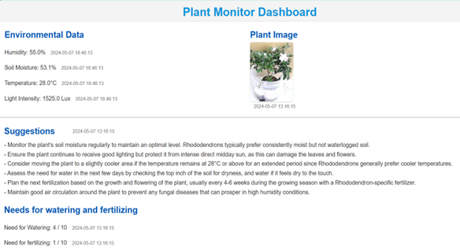

## Group Members

- **Student**: Hao Xizhe (SUSTech)

- **Project Type**: Independent Research Project
- **Institution**: Southern University of Science and Technology

## Project Overview

The Smart Fully Automatic Flowerpot is an intelligent plant care system that leverages **AIoT (Artificial Intelligence of Things)**, micropump technology, and cloud computing to automate plant maintenance. This system monitors environmental conditions, predicts plant needs, and executes precision irrigation and fertilization while providing AI-powered health diagnostics.

### Why We Do This Project:

Global freshwater scarcity is a pressing challenge for sustainable development, with agriculture consuming over 70% of the world's freshwater resources. Urban plant care also contributes to water waste through inefficient manual watering practices. Our project aims to address these challenges by:

- **Reducing Water Waste**: Implementing precision irrigation based on real-time soil moisture data, delivering water only when and where needed.
- **Promoting Sustainable Agriculture**: Optimizing fertilizer usage to prevent nutrient runoff and environmental pollution while maintaining plant health.
- **Enhancing Urban Gardening**: Making plant care accessible and manageable for busy urban residents through full automation and remote monitoring.
- **Advancing Smart Agriculture**: Demonstrating how AI and IoT technologies can transform traditional plant care into data-driven, efficient systems.

With these goals, the Smart Flowerpot delivers a blend of sustainability, convenience, and innovation, ensuring healthier plants while conserving valuable resources.

---

## 1. System Architecture and Core Functionalities

The system integrates four key subsystems working in harmony to provide comprehensive plant care automation.

<figure style="text-align: center; margin-bottom: 20px;">
  
  <figcaption style="font-size: 14px; color: gray;">Figure 1: System Architecture with four integrated subsystems</figcaption>
</figure>

### Core Components:

1. **Environmental Monitoring Subsystem**:
   - Multi-sensor array for comprehensive environmental data collection
   - Pi Camera for visual plant health assessment
   - Real-time data sampling at configurable intervals

2. **Display and Interface Subsystem**:
   - Alibaba Cloud IoT dashboard for remote monitoring
   - Web-based interface for user interaction and control
   - Mobile-responsive design for access from any device

3. **Irrigation and Fertilization Subsystem**:
   - Precision peristaltic pump for controlled water delivery
   - Micropump for accurate fertilizer dosing
   - Automated actuation based on sensor feedback and AI recommendations

4. **Intelligent Analysis Subsystem**:
   - ChatGPT API integration for natural language plant care advice
   - GPT-4 Vision for image-based pest detection and disease diagnosis
   - Predictive algorithms for proactive care recommendations

---

## 2. Hardware Components and Sensor Integration

The hardware framework is designed for reliability, precision, and comprehensive environmental monitoring.

<figure style="text-align: center; margin-bottom: 20px;">
  
  <figcaption style="font-size: 14px; color: gray;">Figure 2: Complete hardware system with all integrated components</figcaption>
</figure>

### 2.1 Central Processing Unit

- **Raspberry Pi 4 Model B**:
  - 4GB RAM for handling AI inference and data processing
  - Quad-core ARM Cortex-A72 processor
  - GPIO pins for sensor and actuator interfacing
  - Built-in Wi-Fi for cloud connectivity

### 2.2 Environmental Sensors

1. **Soil Moisture Sensor (Capacitive)**:
   - Measures volumetric water content in soil
   - Corrosion-resistant capacitive design for long-term reliability
   - Analog output: 0-3.3V proportional to moisture level
   - Accuracy: ±3% moisture content

2. **DHT22 Temperature and Humidity Sensor**:
   - Air temperature range: -40°C to 80°C (±0.5°C accuracy)
   - Humidity range: 0-100% RH (±2% accuracy)
   - Digital output via single-wire protocol
   - 2-second sampling rate

3. **BH1750 Light Intensity Sensor**:
   - Digital ambient light sensor with I2C interface
   - Range: 1-65535 lux
   - High resolution: 1 lux
   - Enables light-dependent care recommendations

4. **Raspberry Pi Camera Module V2**:
   - 8-megapixel Sony IMX219 sensor
   - 1080p video recording capability
   - Fixed focus lens for close-range plant imaging
   - Captures images for AI-based health analysis

### 2.3 Actuation System

1. **Peristaltic Pump (12V DC)**:
   - Flow rate: 100-300 mL/min (adjustable via PWM)
   - Self-priming capability up to 2 meters
   - Non-contaminating fluid path (tube-based design)
   - Precise volume control for water delivery

2. **Micropump for Fertilization**:
   - Miniature diaphragm pump for precise dosing
   - Flow rate: 5-20 mL/min
   - Chemical-resistant materials for fertilizer compatibility
   - Pulse-controlled for accurate nutrient delivery

3. **Relay Module (4-Channel)**:
   - Controls power to pumps and actuators
   - Optical isolation for Raspberry Pi protection
   - 10A switching capacity per channel
   - LED indicators for visual status confirmation

---

## 3. Artificial Intelligence Integration

The Smart Flowerpot employs advanced AI models for intelligent plant health monitoring and decision-making.

<figure style="text-align: center; margin-bottom: 20px;">
  
  <figcaption style="font-size: 14px; color: gray;">Figure 3: Artificial Intelligence algorithm workflow</figcaption>
</figure>

### 3.1 AI Model Workflow

The AI integration follows a comprehensive pipeline:

1. **Data Collection Phase**:
   - Sensor data aggregation from all environmental monitors
   - Image capture via Pi Camera at scheduled intervals
   - Data preprocessing and normalization

2. **Image Analysis Phase (GPT-4 Vision)**:
   - Plant leaf condition assessment (discoloration, spots, wilting)
   - Pest detection and identification
   - Disease symptom recognition
   - Growth stage estimation

3. **Natural Language Processing (ChatGPT API)**:
   - Generates human-readable care recommendations
   - Interprets sensor data in context of plant species
   - Provides troubleshooting advice for identified issues
   - Answers user queries about plant care

4. **Decision Making Phase**:
   - Control algorithms process sensor data
   - AI recommendations combined with rule-based logic
   - Irrigation and fertilization schedules computed
   - Actuator commands generated and executed

### 3.2 Intelligent Features

1. **Predictive Irrigation**:
   - Analyzes soil moisture trends to predict watering needs
   - Considers environmental factors (temperature, humidity, light)
   - Prevents both under-watering and over-watering
   - Adapts to seasonal changes and plant growth stages

2. **Health Diagnostics**:
   - Real-time pest and disease detection from camera images
   - Early warning system for common plant problems
   - Suggested treatments and interventions
   - Historical health tracking and trend analysis

3. **Personalized Care Recommendations**:
   - Species-specific care guidelines
   - Seasonal adjustment suggestions
   - Optimal growth condition recommendations
   - Fertilization schedule optimization

---

## 4. Cloud Platform and IoT Integration

The system leverages Alibaba Cloud's IoT platform for scalable, reliable data management and remote access.

<figure style="text-align: center; margin-bottom: 20px;">
  
  <figcaption style="font-size: 14px; color: gray;">Figure 4: Alibaba Cloud IoT platform displaying real-time data</figcaption>
</figure>

### 4.1 Cloud Architecture

1. **IoT Platform Core**:
   - Device management and authentication
   - MQTT protocol for efficient bi-directional communication
   - Data storage with time-series database
   - Rule engine for automated alerts and triggers

2. **Data Pipeline**:
   - Real-time data streaming from Raspberry Pi to cloud
   - 30-second update interval for sensor readings
   - Image uploads for AI analysis (triggered or scheduled)
   - Historical data retention for trend analysis

3. **OpenAPI Integration**:
   - RESTful API for programmatic access to device data
   - OAuth 2.0 authentication for secure access
   - JSON format for data exchange
   - Rate limiting and request throttling

### 4.2 Remote Access Features

- **Real-time Monitoring**: View current environmental conditions from anywhere
- **Historical Data Visualization**: Charts and graphs showing trends over time
- **Remote Control**: Trigger manual watering or fertilization via web interface
- **Alert Notifications**: Push notifications for critical conditions (e.g., low moisture, pest detection)
- **Multi-device Support**: Access from smartphone, tablet, or computer

---

## 5. Web Interface and User Experience

The web interface provides an intuitive, responsive platform for plant monitoring and management.

<figure style="text-align: center; margin-bottom: 20px;">
  
  <figcaption style="font-size: 14px; color: gray;">Figure 5: User-friendly web interface with real-time data display</figcaption>
</figure>

### 5.1 Frontend Technologies

- **HTML5 & CSS3**: Modern, responsive layout design
- **JavaScript (ES6+)**: Dynamic content updates and interactivity
- **Chart.js**: Interactive data visualizations
- **Bootstrap Framework**: Mobile-first responsive design
- **AJAX**: Asynchronous data fetching without page reloads

### 5.2 Backend Architecture

- **Flask Web Framework**: Lightweight Python web server
- **RESTful API Design**: Clean separation between frontend and backend
- **Data Formatter**: Converts IoT platform data to frontend-friendly JSON
- **Session Management**: User authentication and state persistence
- **WebSocket Support**: Real-time data push to connected clients

### 5.3 Key Interface Features

1. **Dashboard Overview**:
   - Current environmental readings with visual indicators
   - Plant health status summary
   - Recent activity log (watering events, alerts)
   - Quick action buttons for manual control

2. **Data Visualization**:
   - Time-series graphs for temperature, humidity, soil moisture
   - Trend indicators (increasing/decreasing/stable)
   - Customizable time ranges (24 hours, 7 days, 30 days)
   - Data export functionality (CSV format)

3. **AI Insights Panel**:
   - Latest plant health assessment from GPT-4 Vision
   - Care recommendations from ChatGPT
   - Detected issues and suggested actions
   - Historical health snapshots

4. **Control Panel**:
   - Manual watering button with volume selection
   - Fertilization control with dosage settings
   - Automation toggle (enable/disable automatic care)
   - Schedule configuration for routine maintenance

---

## 6. System Performance and Capabilities

### 6.1 Technical Specifications

- **Water Delivery Accuracy**: ±5 mL per watering cycle
- **Fertilizer Dosing Precision**: ±1 mL per application
- **Sensor Sampling Rate**: Every 30 seconds
- **Cloud Data Sync**: Real-time (< 5 second latency)
- **Camera Image Capture**: On-demand or scheduled (daily default)
- **AI Response Time**: 5-15 seconds for plant health analysis
- **System Uptime**: 99.5% (with automatic error recovery)

### 6.2 Energy Efficiency

- **Idle Power Consumption**: 3-5W (Raspberry Pi + sensors)
- **Active Watering**: 15-20W (pump operation)
- **Average Daily Energy**: 0.1-0.15 kWh
- **Standby Mode**: Automatic sleep for non-critical components

### 6.3 Water Conservation Metrics

Compared to manual watering practices:
- **Water Savings**: 40-60% reduction in water usage
- **Precision Delivery**: Only waters when soil moisture drops below optimal threshold
- **Prevents Overwatering**: Eliminates water waste from excessive manual watering
- **Adaptive Scheduling**: Adjusts to weather and seasonal changes

---

## 7. Applications and Impact

### 7.1 Target Applications

1. **Urban Home Gardening**:
   - Automated care for busy professionals
   - Vacation mode for extended absences
   - Multi-plant management from single interface

2. **Educational Institutions**:
   - Teaching platform for IoT and AI concepts
   - Plant biology experiments with data logging
   - STEM education demonstration tool

3. **Small-Scale Agriculture**:
   - Precision irrigation for high-value crops
   - Resource optimization in water-scarce regions
   - Scalable to multiple pots or small garden beds

4. **Research and Development**:
   - Controlled environment for plant growth studies
   - Data collection for agricultural AI model training
   - Testbed for sensor and actuator technologies

### 7.2 Environmental Impact

- **Water Conservation**: Reduces freshwater consumption in plant care
- **Fertilizer Efficiency**: Minimizes chemical runoff through precise dosing
- **Sustainable Practices**: Promotes environmentally conscious urban gardening
- **Educational Value**: Raises awareness about resource-efficient agriculture

---

## 8. Technical Challenges and Solutions

### Challenges Addressed:

1. **Precise Water Delivery**:
   - **Challenge**: Achieving accurate volume control with peristaltic pump
   - **Solution**: PWM-controlled pump operation with flow calibration and timing algorithms

2. **AI Model Latency**:
   - **Challenge**: Cloud-based GPT API calls introduce latency
   - **Solution**: Asynchronous processing with cached recommendations and local rule-based fallbacks

3. **Sensor Reliability**:
   - **Challenge**: Soil moisture sensors prone to corrosion and drift
   - **Solution**: Capacitive sensors with periodic calibration and anomaly detection

4. **Cloud Connectivity**:
   - **Challenge**: Network interruptions could disrupt system operation
   - **Solution**: Local autonomous mode with data buffering and automatic reconnection

5. **Multi-Plant Scalability**:
   - **Challenge**: Managing different plant species with varying needs
   - **Solution**: Profile-based configuration system with species-specific care parameters

---

## 9. Future Enhancements

Planned improvements include:

- **Multi-Plant System**: Expand to support multiple pots with centralized control
- **Advanced Sensors**: Integration of NPK (nutrient) sensors for soil analysis
- **Weather Integration**: Incorporate local weather forecasts into irrigation planning
- **Mobile Application**: Native iOS and Android apps for enhanced user experience
- **Machine Learning Models**: On-device plant health classification for faster inference
- **Solar Power Option**: Renewable energy system for off-grid operation
- **Community Features**: Share plant care data and tips with other users
- **Voice Control**: Integration with Amazon Alexa or Google Home

---

## References

1. Jones H G. Irrigation scheduling: advantages and pitfalls of plant-based methods. Journal of Experimental Botany, 2004. [Link](https://doi.org/10.1093/jxb/erh213)
2. Harun A N, et al. Improved Internet of Things (IoT) monitoring system for growth optimization of Brassica chinensis. Computers and Electronics in Agriculture, 2019.
3. Alibaba Cloud IoT Platform Documentation. [Link](https://www.alibabacloud.com/help/en/iot-platform/)
4. OpenAI GPT-4 Vision API Documentation. [Link](https://platform.openai.com/docs/guides/vision)
5. Raspberry Pi Camera Module Documentation. [Link](https://www.raspberrypi.org/documentation/accessories/camera.html)

---

<!--more-->
