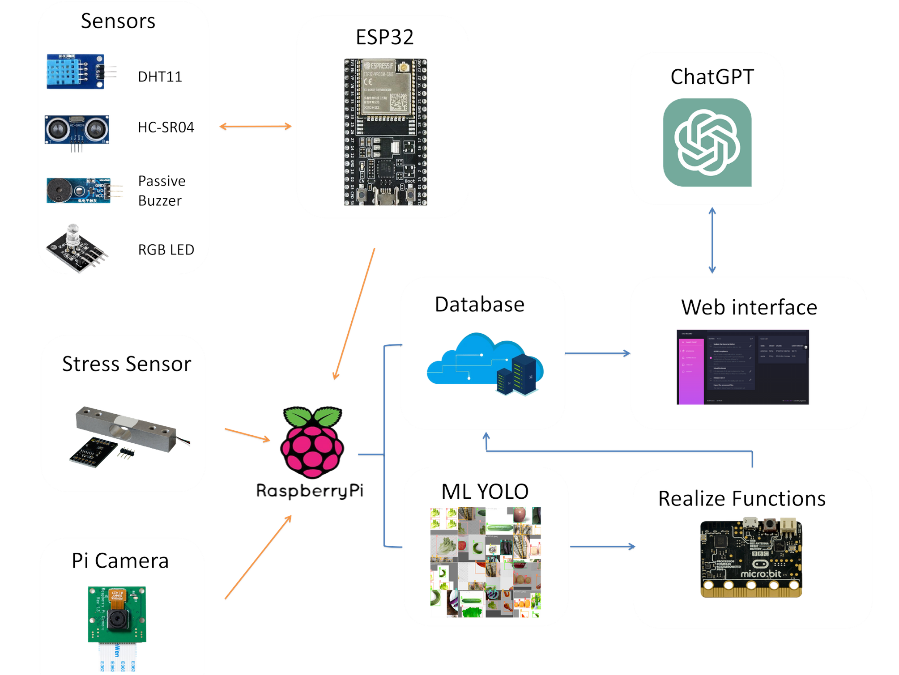

## Group Members
- **Students**: Hao Xizhe (SUSTech), Sun Quanen (UESTC), Wang Gengnan (BUPT), Hong Shiwei (SCU)
- **Professor**: Tan Wee Kek (NUS)
- **Teaching Assistants**: Wu Haiyang, Li Xin (NUS)

## Project Overview
The Smart Refrigerator leverages **AIoT (Artificial Intelligence of Things)** principles to monitor and manage refrigerator contents. With this system, users can track food freshness, receive warnings on expired items, and access recommendations for food usage based on fridge contents.

### Why We Do This Project:
In today’s fast-paced world, food waste has become a growing concern, and many households struggle with managing food storage effectively. Our project aims to address these challenges by:
- **Reducing Food Waste**: Proactively tracking expiration dates and providing timely alerts to prevent spoilage.  
- **Promoting Sustainability**: Optimizing food usage with AI-powered recipe suggestions, encouraging users to consume available ingredients efficiently.  
- **Enhancing User Convenience**: Automating inventory management to save time and effort, making food management smarter and simpler.

With these goals, the Smart Refrigerator delivers a blend of convenience, sustainability, and innovation, ensuring smarter food management for households and businesses alike.

## 0. Download Poster

📄 **Download the Project Poster**:  
  
*Click the button above to access the detailed project poster in PDF format.*

## 1. System Roadmap and Core Functionalities

The system is built on a **Raspberry Pi** platform, integrated with sensors and AI-based predictions for real-time monitoring.

### Core Sensors and Functions:
- **Environmental Monitoring**: Tracks temperature, humidity, and door status using sensors.
- **Food Inventory Management**: Provides real-time updates on stored food, including weight and freshness predictions.
- **Proactive Alerts**: Sends warnings for expired items or abnormal environmental conditions.
- **AI-Driven Suggestions**: Recommends recipes based on available ingredients.

  
*Figure 1: System architecture with AI and IoT integration*

---

## 2. Hardware Components

This system relies on several key hardware components to collect and transmit data accurately:

- **Weight Sensor (HX711)**: Accurately monitors the weight of stored food items.
- **Communication Systems**: Uses both **serial** and **radio communication** to transfer data between components.
- **AI Model Roadmap**: 
  1. Weight data collection.
  2. Initial AI predictions on the Raspberry Pi.
  3. Uses a pre-trained AI model on a PC.
  4. Raspberry Pi captures images with Pi Camera.
  5. Updates are made to a cloud-based web database.

<!--   
*Figure 2: Hardware components setup and weight sensors (HX711)*

---

## 3. Artificial Intelligence Integration

The Smart Refrigerator uses a **pre-trained AI model** to assess food expiration and predict freshness. The Raspberry Pi’s AI capabilities enable real-time predictions with high accuracy, evaluated through:

- **Confusion Matrix** and **F1-Confidence Curve** to track prediction performance.

  
*Figure 3: AI model structure and validation matrices*

### Prediction Process:
1. **Data Collection**: Information from sensors is processed by the AI model.
2. **Validation**: The AI predictions are validated and updated periodically to improve model accuracy.

---

## 4. Web Interface and Database Management

The system features a **web-based interface** that allows users to interact with the Smart Refrigerator's data.

### Web Service Structure:
- A multi-tiered approach for data handling, from **data collection** to **user presentation**.
- **Database**: Built with MySQL and PyMySQL, managed through SQLAlchemy.
- **Data Tables**: 
  - `RealtimeData`: Current fridge data.
  - `FoodLibrary`: Reference data for food storage times.
  - `Storage`: Data on food items in the fridge.

### User Interface:
Designed with **HTML, JavaScript, and CSS** for a smooth user experience.

#### Key Pages:
1. **Index Page**: Provides an overview of fridge contents, environmental conditions, and food expiration warnings.
     
   *Figure 4: Web Interface - Index Page showing fridge contents and expiration alerts*

2. **Table List Page**: Displays stored food data, including weight, names, and timestamps.
     
   *Figure 5: Table list displaying detailed storage data*

3. **ChatGPT Recommendation Page**: Generates recommendations for recipes or meals based on available fridge ingredients.
     
   *Figure 6: Recommendations based on current ingredients*

#### Additional Functionalities:
- **Insert & Delete Operations**: Allows for adding and removing food items. The system identifies the closest item by weight (within ±20g) for deletion.

---

## 5. References and Technologies

The Smart Refrigerator project integrates several advanced technologies:
- **YOLOv8**: Supports image-based AI model processing.
- **Huawei Cloud**: For remote storage and data handling.
- **Flask**: Backend API framework for managing database interactions.

  
*Figure 7: Technology stack and backend architecture* -->

---

## References
1. Black Dashboard Template: [Link](https://demos.creative-tim.com/black-dashboard-flask/docs/1.0/plugins/chart-js.html)
2. Food Library: [Link](https://www.realsimple.com/food-recipes/shopping-storing/freezing/how-long-food-last-freezer)
3. YOLOv8 Documentation: [Link](https://docs.ultralytics.com/models/yolov8/#supported-modes)
4. Aheleroff S, et al. IoT-enabled smart appliances under Industry 4.0. Advanced Engineering Informatics, 2020.
5. Basa J J A, et al. Smart inventory management system. arXiv, 2019.

---

<!--more-->
