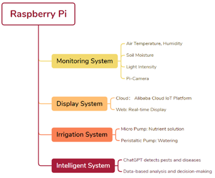
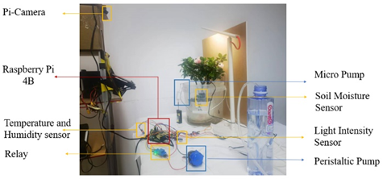
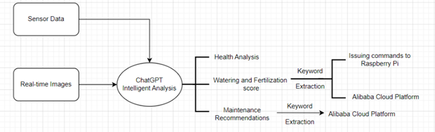
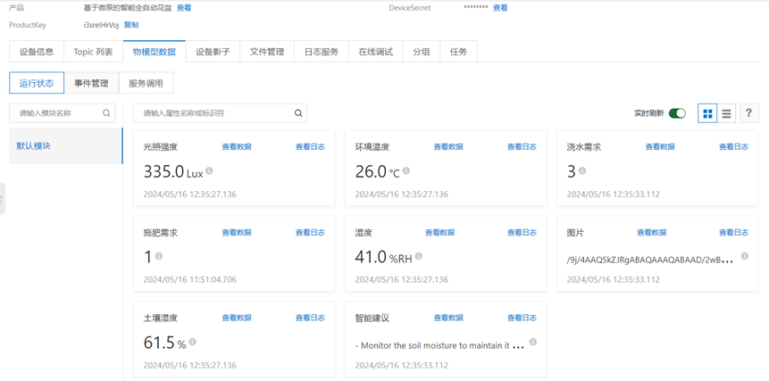
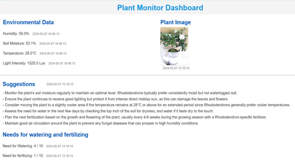

## Project Overview
Global freshwater scarcity is a pressing challenge for sustainable development, with agriculture consuming over 70% of the world's freshwater resources—much of which is wasted due to inefficient irrigation methods. In parallel, modern lifestyles have increased the demand for remote plant care solutions. To address these challenges, I developed an **intelligent, fully automatic flowerpot system** that integrates cutting-edge technologies such as micropumps, intelligent sensors, IoT cloud platforms, and AI-powered large language models. This system ensures precise control of plant care, providing the ideal environment for growth while significantly reducing water waste.

### Why We Do This Project:
- **Tackle Global Water Scarcity**: Freshwater demand continues to rise, especially in agriculture, which is the largest consumer. This project aims to create a water-efficient solution to reduce waste and optimize resource use. 
- **Enhance Agricultural Sustainability**: Traditional irrigation methods are often wasteful and lack precision. By enabling accurate, need-based water and nutrient control, this project promotes more sustainable farming practices.  
- **Accommodate Busy Lifestyles**: With increasingly hectic schedules and frequent travel, people often find it difficult to care for plants consistently. This automated planter ensures reliable plant maintenance even when users are unavailable.  
- **Support Plant Enthusiasts and Beginners**: Caring for plants, particularly exotic or sensitive species, can be challenging for inexperienced growers. The system provides smart recommendations and automation to simplify plant care.  
- **Drive Technological Advancement**: By combining AI, IoT, and sensor technologies, this project demonstrates how cutting-edge innovations can address practical challenges and contribute to the development of smart agriculture.  

## 1. System Architecture

<figure style="text-align: center; margin-bottom: 20px;">
  
  <figcaption style="font-size: 14px; color: gray;">Figure 1: System Architecture Diagram</figcaption>
</figure>
The architecture illustrates the system's modular design, highlighting the key components:
- **Monitoring System**: Tracks air temperature, humidity, soil moisture, and light intensity using advanced sensors and a Pi-Camera for real-time imaging.
- **Display System**: Uses the Alibaba Cloud IoT platform for data processing and real-time display on a web-based dashboard.
- **Irrigation System**: Incorporates a peristaltic pump and a micropump to deliver precise watering and fertilization.
- **Intelligent System**: Leverages ChatGPT for detecting pests, analyzing plant health, and providing actionable insights for maintenance.
---

## 2. Hardware Components
<figure style="text-align: center; margin-bottom: 20px;">
  
  <figcaption style="font-size: 14px; color: gray;">Figure 2: Hardware Physical Picture</figcaption>
</figure>
The hardware framework is centered on a **Raspberry Pi**, which acts as the control hub. It is equipped with various sensors and modules to facilitate data collection and actuation:

- **Environmental Monitoring**: Sensors measure humidity, soil moisture, temperature, and light intensity in real-time.
- **Irrigation Control**: A peristaltic pump, managed by a relay module, provides precise water delivery to plants.
- **Fertilization Mechanism**: A micropump communicates with the software to regulate fertilizer application accurately.
- **High-Definition Camera**: Captures real-time images of plants for visual monitoring and AI analysis.

The hardware design ensures precise gardening automation by collecting environmental data and implementing corresponding actions through controlled actuation.

---
## 3. Software Side
<figure style="text-align: center; margin-bottom: 20px;">
  
  <figcaption style="font-size: 14px; color: gray;">Figure 3: Artificial Intelligence Algorithm Flowchart</figcaption>
</figure>
The system's software layer integrates AI technologies and control logic to process data and interact with users:

- **Natural Language Processing**: Through OpenAI's ChatGPT API, the system enables natural language interaction, allowing users to query plant status and receive care advice in real-time.
- **Visual Recognition**: Powered by GPT-4's image analysis capabilities, the system evaluates plant growth, identifying anomalies and providing actionable feedback.
- **Control Algorithms**: The software processes sensor data and coordinates irrigation and fertilization schedules to maintain optimal plant health.

This layer bridges hardware functionalities with the user interface, enhancing automation and accessibility.
---

## 4. Cloud Platform
<figure style="text-align: center; margin-bottom: 20px;">
  
  <figcaption style="font-size: 14px; color: gray;">Figure 4: Cloud Platform Display</figcaption>
</figure>
To enable scalability and remote access, the system integrates **Alibaba Cloud's IoT platform**:

- **Data Management**: The IoT platform processes large-scale sensor and image data efficiently.
- **Remote Access**: Real-time data transmission via **Alibaba Cloud OpenAPI** allows users to monitor plant conditions and manage devices from anywhere.
- **Custom Programs**: Backend scripts handle data preprocessing and transmission, ensuring seamless communication between devices and the cloud.

The cloud platform enhances the system's user-friendliness and scalability by offering robust device management and connectivity.
---

## 5. Web Page

The **web interface** is designed for intuitive interaction, displaying real-time plant data and care insights. It is built using **HTML**, **CSS**, and **JavaScript** and features the following core functionalities:

### 5.1 Webpage Structure and Features

The interface is divided into four sections:

1. **Environmental Data**: Displays real-time measurements of humidity, soil moisture, temperature, and light intensity, each with corresponding timestamps.
2. **Plant Image**: Shows a high-definition image of the plant, converted from Base64 to JPEG format, with a timestamp for capture time.
3. **Suggestions**: Provides actionable plant care advice based on real-time analysis, including recommendations for watering, light exposure, and temperature adjustments.
4. **Watering and Fertilizing Needs**: Displays the plant's current requirements on a scale, helping users make informed decisions.

### 5.2 Data Handling Workflow

1. **Backend Integration**: Data from the IoT platform is processed using a **Flask** backend, which:
   - Verifies the device's credentials (device name, product name, product password).
   - Fetches and formats the sensor data.
   - Converts timestamps from milliseconds to human-readable 24-hour format.
   - Prepares the data for frontend presentation.

2. **Dynamic Updates**: Using JavaScript, the frontend dynamically updates the interface by:
   - Mapping the backend's data to HTML elements.
   - Rendering Base64-encoded images into readable formats for user convenience.

<figure style="text-align: center; margin-bottom: 20px;">
  
  <figcaption style="font-size: 14px; color: gray;">Figure 5: User Web Page
  </figcaption>
</figure>

### 5.3 User Interface Design

The webpage is visually structured for clarity and ease of use:
- **Title and Sections**: Prominent headers distinguish key sections like "Environmental Data" and "Suggestions."
- **Styling and Responsiveness**: A CSS-based layout ensures the dashboard is aesthetically pleasing and responsive across devices.
- **Accessibility**: The interface supports intuitive navigation, making plant monitoring straightforward for all users.

## 6. Overall Workflow

1. **Data Collection**: Sensors and the camera collect real-time environmental data and plant images.
2. **Local Processing**: The Raspberry Pi processes and transmits data to the cloud using the IoT platform.
3. **Cloud Management**: Alibaba Cloud's IoT platform handles data storage, processing, and API requests.
4. **Backend Operations**: The Flask server retrieves and formats the data for frontend integration.
5. **Frontend Display**: The web interface dynamically displays the processed data, allowing users to monitor and manage their plants effortlessly.

## 7. Conclusion

This system offers a robust and scalable solution for automated plant care by combining precise hardware, intelligent software, and cloud-enabled connectivity. The integration of a dynamic web interface further ensures an intuitive and accessible user experience, making plant monitoring and maintenance both efficient and user-friendly.

---
<!--more-->